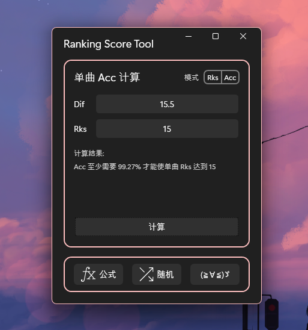

<div align="center">
    
    <h1>Ranking Score Tool</h1>
    <p>🕊Phigros 单曲 Rks / Acc 计算工具</p>
    <a href="https://github.com/OrgEleCho/EleCho.WpfSuite" style="text-decoration:none;margin:0.5em">EleCho.WpfSuite✅</a>
    <a href="https://github.com/CommunityToolkit/dotnet" style="text-decoration:none;margin:0.5em">CommunityToolkit.Mvvm✅</a>
    <a href="https://github.com/miniyu157/KlxPiao.ColorTool" style="text-decoration:none;margin:0.5em">KlxPiao.ColorTool✅</a>
</div>

---

## 🍍预览
<div align="center">
    
</div>

## 🍉安装

转到 [Releases](https://github.com/miniyu157/RankingScoreTool/releases) 下载，或者使用下面的命令下载源代码并编译
```bash
git clone https://github.com/miniyu157/RankingScoreTool
```

## 🍓公式参考

[[TapTap]关于Phigros中Ranking Score（rks）的说明及疑难解答](https://www.taptap.cn/moment/181012542707992850)

## 🍞许可证
[MIT License](./LICENSE)